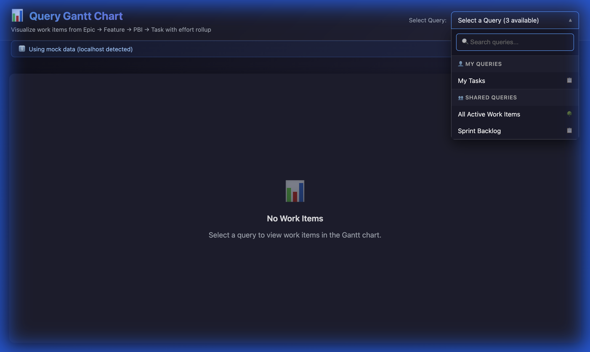
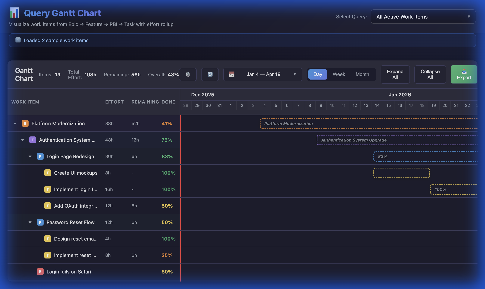
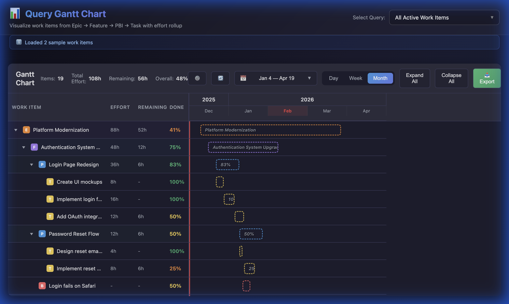
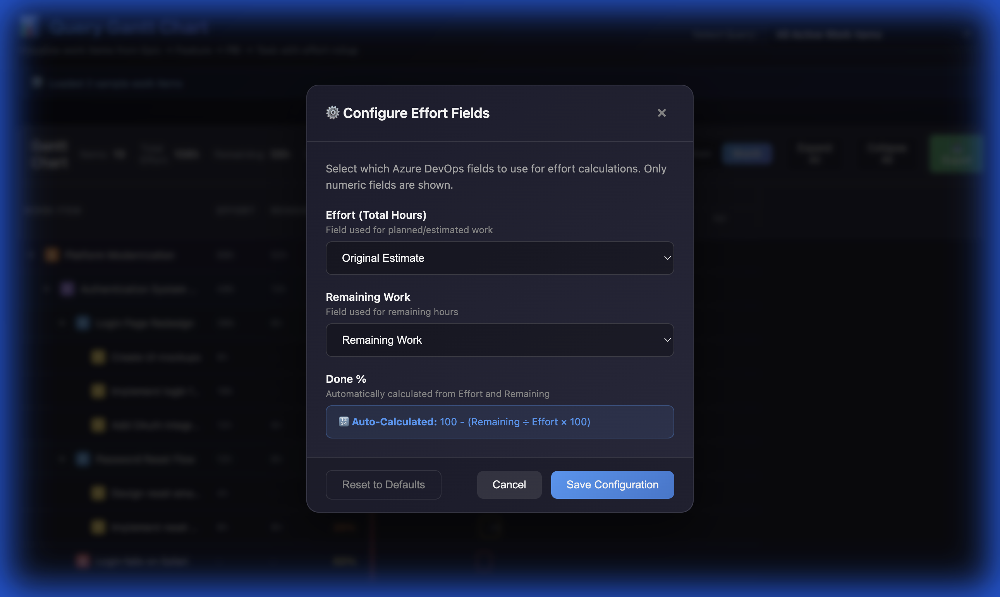

# Azure DevOps Query Gantt Chart Extension

A custom Azure DevOps extension that adds a **Gantt Chart** hub to visualize work items from **Epic → Feature → PBI → Task** with automatic effort rollup and percent complete calculations.

## Screenshots

### Query Selector with Folder Grouping


### Gantt Chart - Day View


### Gantt Chart - Month View


### Field Configuration


## Features

- 📊 **Gantt Chart Visualization** - View work items on a timeline with progress bars
- 🔄 **Effort Rollup** - Automatically calculates effort from Task level up
- 📈 **Auto-Calculated Done %** - Automatically computed from Effort and Remaining Work
- 🌳 **Hierarchical View** - Collapsible tree structure (Epic → Feature → PBI → Task)
- 🔍 **Enhanced Query Selector** - Search queries with folder grouping (My Queries/Shared Queries)
- 🎨 **Modern UI** - Dark theme with smooth animations and glassmorphism effects
- 📅 **Multiple View Modes** - Day, Week, and Month timeline views with dynamic scaling
- ⚙️ **Configurable Fields** - Choose which fields to use for effort calculations

## Work Item Hierarchy

```
Epic (Level 0)
└── Feature (Level 1)
    └── Product Backlog Item (Level 2)
        └── Task (Level 3)
```

## Effort Rollup Logic

- **Tasks**: Use configurable fields (default: `Original Estimate`, `Remaining Work`)
- **Parent Items**: Sum of all descendant effort values
- **Done %**: Automatically calculated as `100 - (Remaining Work / Effort × 100)`

## Installation

### Prerequisites

- Node.js 18+ 
- npm 9+
- Azure DevOps organization
- TFX CLI (`npm install -g tfx-cli`)

### Build & Package

```bash
# Install dependencies
npm install

# Build the extension
npm run build

# Package for distribution
npm run package
```

This creates a `.vsix` file that can be uploaded to the Azure DevOps Marketplace.

### Local Development

```bash
# Start development server
npm run start:dev
```

The dev server runs at `https://localhost:3001`.

## Configuration

### Update Publisher ID

Edit `vss-extension.json` and replace `your-publisher-id` with your Azure DevOps Marketplace publisher ID:

```json
{
    "publisher": "your-actual-publisher-id"
}
```

### Field Configuration

Click the ⚙️ button in the Gantt chart toolbar to configure:
- **Effort Field** - Field used for planned/estimated work
- **Remaining Work Field** - Field used for remaining hours
- **Done %** - Automatically calculated from Effort and Remaining fields

### Required Scopes

The extension requires the following Azure DevOps scopes:
- `vso.work` - Read work items and queries

## Usage

1. Navigate to **Azure Boards** in your Azure DevOps project
2. Click on **Query Gantt Chart** in the hub navigation
3. Select a query from the enhanced dropdown (supports search and folder grouping)
4. The Gantt chart displays with:
   - Work item hierarchy on the left
   - Timeline with progress bars on the right
   - Effort rollup and percent complete for each item

### Toolbar Controls

| Control            | Description                   |
| ------------------ | ----------------------------- |
| **Day/Week/Month** | Switch timeline view modes    |
| **⚙️ Settings**     | Configure effort fields       |
| **🔄 Refresh**      | Reload data from Azure DevOps |
| **Expand All**     | Expand entire hierarchy       |
| **Collapse All**   | Collapse to top level         |

## Project Structure

```
azure-devops-query-ui-hub/
├── src/
│   ├── components/
│   │   ├── GanttChart/
│   │   │   ├── GanttChart.tsx     # Main Gantt component
│   │   │   ├── GanttRow.tsx       # Work item row
│   │   │   ├── GanttBar.tsx       # Progress bar
│   │   │   ├── GanttTimeline.tsx  # Timeline header
│   │   │   └── GanttChart.css     # Styles
│   │   ├── QuerySelector/
│   │   │   ├── QuerySelector.tsx  # Enhanced query dropdown
│   │   │   └── QuerySelector.css  # Dropdown styles
│   │   ├── FieldConfig/
│   │   │   ├── FieldConfigModal.tsx  # Field settings modal
│   │   │   └── FieldConfigModal.css  # Modal styles
│   │   └── QueryGanttHub/
│   │       ├── QueryGanttHub.tsx  # Main hub component
│   │       └── QueryGanttHub.css  # Hub styles
│   ├── services/
│   │   ├── AzureDevOpsService.ts     # API integration
│   │   ├── WorkItemHierarchyService.ts # Hierarchy building
│   │   ├── EffortRollupService.ts    # Effort calculations
│   │   ├── FieldConfigService.ts     # Field configuration
│   │   └── MockDataService.ts        # Sample data for testing
│   ├── models/
│   │   └── WorkItemModels.ts      # TypeScript interfaces
│   ├── utils/
│   │   └── DateUtils.ts           # Date helpers
│   ├── QueryGanttHub.tsx          # Entry point
│   └── QueryGanttHub.html         # HTML template
├── images/                        # README screenshots
├── static/
│   └── images/
│       └── gantt-icon.png         # Extension icon
├── vss-extension.json             # Extension manifest
├── package.json
├── tsconfig.json
└── webpack.config.js
```

## Version History

### v1.2.33 (Latest)
- Fixed start-date resolution so each work item follows: Start Date -> Iteration Start Date -> Parent-chain Start Date -> Created Date.
- Added iteration metadata lookup from Azure DevOps iterations so sprint start dates are used when item start date is blank.
- Enhanced Gantt hover details with owner, iteration path, effort, remaining, completed, and effective start/end dates.

### v1.2.1
- ✅ Auto-calculated Done % from Effort and Remaining fields
- ✅ Timeline properly scales when switching Day/Week/Month views
- ✅ Enhanced query selector with solid background and folder grouping
- ✅ Removed sample data toggle button
- ✅ Improved toolbar spacing

### v1.2.0
- Added configurable field mappings
- Enhanced query selector with search and favorites
- Fixed week/month timeline views

### v1.1.x
- Query integration improvements
- UI enhancements
- Bug fixes

## Troubleshooting & Known Issues

### "Content Security Policy" blocks 'eval'
If you see an error about `unsafe-eval` in the console:
- This is caused by webpack source maps.
- **Fix**: Build with `devtool: false` (already configured in v1.0.6+).

### Authentication Hanging
If the extension hangs on "Loading...":
- Check the console for `[AzureDevOpsService]` logs.
- Ensure your network allows access to `dev.azure.com`.
- The extension now uses native `fetch()` calls to bypass potential SDK client library issues.

### "No project context" Error
- Ensure you are viewing the hub within an active Azure DevOps project.
- The extension URL should look like: `https://dev.azure.com/{org}/{project}/_apps/hub/...`

## License

MIT
